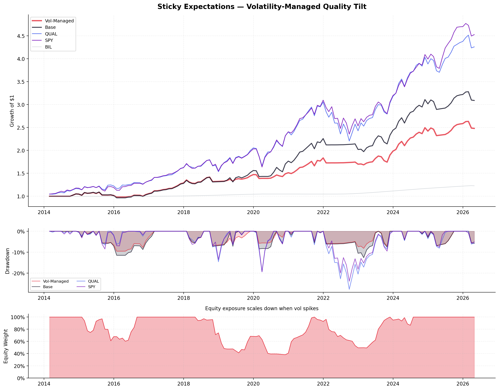
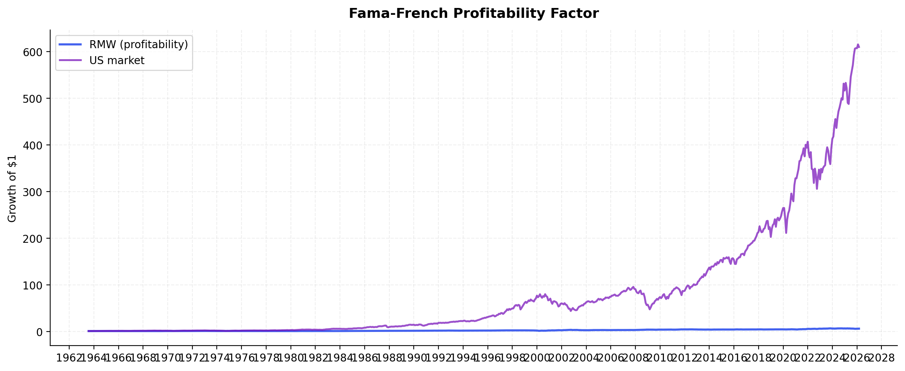

# Sticky Expectations Quality Tilt

F419 Behavioral Finance project. The idea: analysts are too slow to update forecasts on firms that keep posting strong profits. The profitability premium persists because expectations are sticky, not because risk changes.

We build a simple monthly strategy around this with three ETFs: QUAL (quality factor), SPY (market), BIL (T-bills). When QUAL is above its 9-month moving average, hold a 50/50 QUAL/SPY blend. When it drops below, rotate to BIL. Two parameters, optimized on 2014–2020 data.

The twist is volatility-managed position sizing (Moreira & Muir 2017). During risk-on months, scale equity exposure by `median_vol / realized_vol`, capped at 1. When vol is low, take the full position. When vol spikes, size down automatically. The logic ties back to the behavioral story: low vol = low attention = stickier expectations = the anomaly is strongest. No leverage, no extra parameters.

## Results

| | Return | Vol | Sharpe | Max DD | Calmar |
|---|---|---|---|---|---|
| **Vol-Managed** | +7.69% | 8.75% | 0.89 | **-9.56%** | **0.81** |
| Base | +9.64% | 10.77% | 0.91 | -12.65% | 0.76 |
| QUAL | +12.55% | 14.72% | 0.88 | -27.78% | 0.45 |
| SPY | +13.12% | 14.40% | 0.93 | -23.93% | 0.55 |

You give up ~2pp of annual return vs the base strategy. You get max drawdown of -9.56% instead of -12.65% (and instead of -27.78% for QUAL or -23.93% for SPY). The Calmar ratio is the best of the group at 0.81.



The Fama-French RMW factor shows the profitability premium is real over the long run:



## Reproduce

```
pip install pandas numpy matplotlib yfinance
python backtest.py
```

Pulls data from Ken French and Yahoo Finance, runs optimization, prints metrics, saves charts to `outputs/`.
